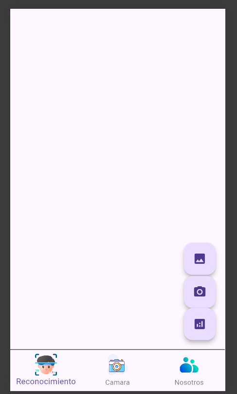
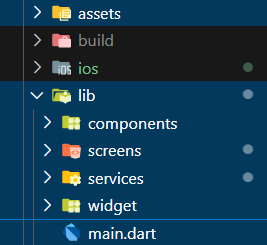
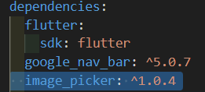
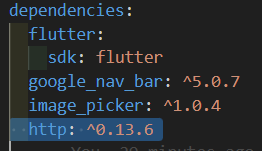

# FutterCoders
Este repositorio es para la materia de flutter
# Aplicación

## Estructura del Proyecto

### ¿Cómo replicar el proyecto?
1. Crear las siguientes archivos
    
    - components
    
    Copiar el código: **galeria_components.dart** 
    Agregar la siguiente línea **image_picker: ^1.0.4** en el pubspec.yaml
    
    

    Luego, desde la terminal en dirección a nuestro proyecto, escribir los siguiente comandos: **flutter pub get**, **flutter pub upgrade**

    - screens
    
    Crear el archivo **camera_screen.dart** y pegar el código 
    
    Craar el archivo **menu_screen.dart** y pegar el código correspondiente.

    Craer el archivo **reconocimiento_screen.dart** y pegar el código que corresponde, luego agregar **http**  en el pubspec.yaml, de igual manera escribir los siguientes comandos: **flutter pub get**, **flutter pub upgrade** 

    - services

    Craer el archivo *objectDetectionService.dart* y copiar el código correspondiente

    - widgets

    Crear el archivo **cart_widgets.dart**, copia el código y pegarlo tal cual.

 ### ¿Cómo compilar el proyecto?
   
   Desde la terminal, en la ubicación del proyecto escribir el comando **flutter run**

 ### ¿Cómo cambiar el ícono de nuestra aplicación?

 Seguir los pasos que se encuentra en:    
[📄 Documento ](docs/icono.docx)

